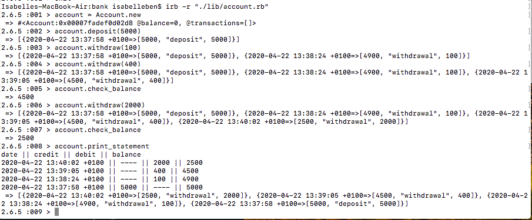

## Bank Tech Test ##

Tech-test to create a simple Bank app.

## Setup ##

Clone the repo:

`git clone git@github.com:Benjamaker/bank-tech-test.git`

Install dependencies:

`bundle install`

## To run tests ##

For feature test, run script from CLI:

`ruby feature_spec.rb`

Unit tests:

`rspec`

## Specification ##
#### Requirements ####

- You should be able to interact with your code via a REPL like IRB or the JavaScript console. (You don't need to implement a command line interface that takes input from STDIN.)
- Deposits, withdrawal.
- Account statement (date, amount, balance) printing.
- Data can be kept in memory (it doesn't need to be stored to a database or anything).

#### Acceptance criteria ####

**Given** a client makes a deposit of 1000 on 10-01-2012..

**And** a deposit of 2000 on 13-01-2012..

**And** a withdrawal of 500 on 14-01-2012..

**When** she prints her bank statement..

**Then** she would see:

```
date || credit || debit || balance
14/01/2012 || || 500.00 || 2500.00
13/01/2012 || 2000.00 || || 3000.00
10/01/2012 || 1000.00 || || 1000.00
```

## User Stories ##

I decided to break the problem / specifications down into the below user stories:  

```
As a customer..

So I know how much money I have, I want to check my account balance.

So I can keep my money safe, I want to deposit some money into my account.

So I can buy things, I want to withdraw some money from my account.

So I can keep track of my transactions, I want to know the date of each transaction.

So I can review my finances, I want to print a full list of transactions.
```

## Planning ##

From the above user stories, I created a table of key nouns and verbs to inform which attributes and methods I would be likely to need.

| Nouns | Verbs |
|:-----:|:-----:|
| Account | Withdraw |
| | Deposit |
| Balance | Check |
| Transactions | Track date/time |
| Statement | Print |

I decided that to keep things simple, I would try to build one class `Account` and then would have the possibility to refactor later if required.

I came up with the following rough outline of attributes and methods for my `Account` class:

| Attributes | Methods |
|:---------:|:------:|
| balance | check_balance |
| transactions | record_transaction |
|| withdraw(money)
|| deposit(money)
|| print_statement


## App demo (IRB) ##


